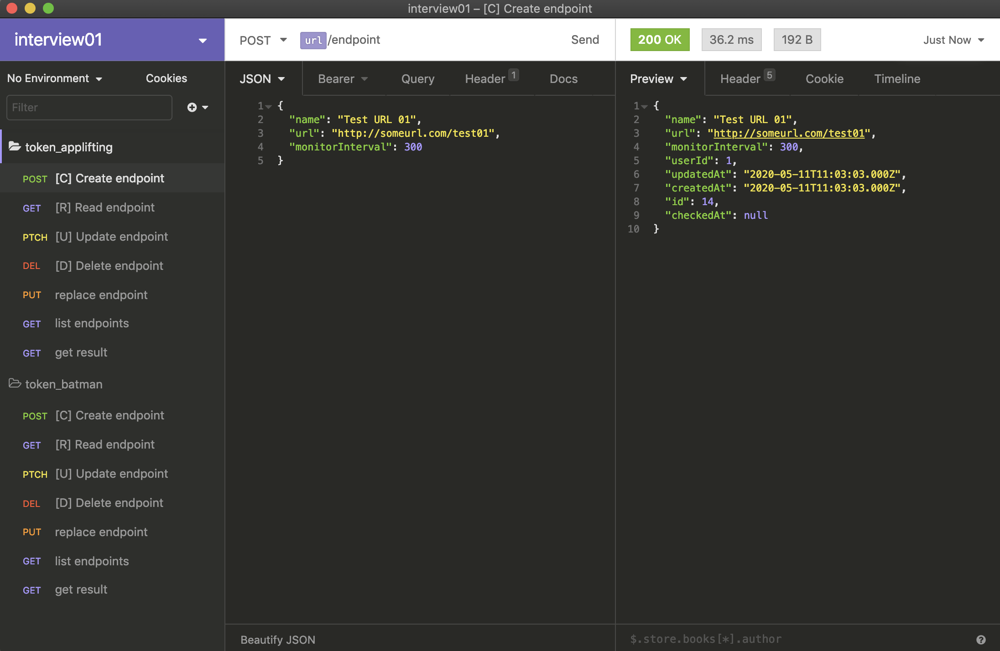
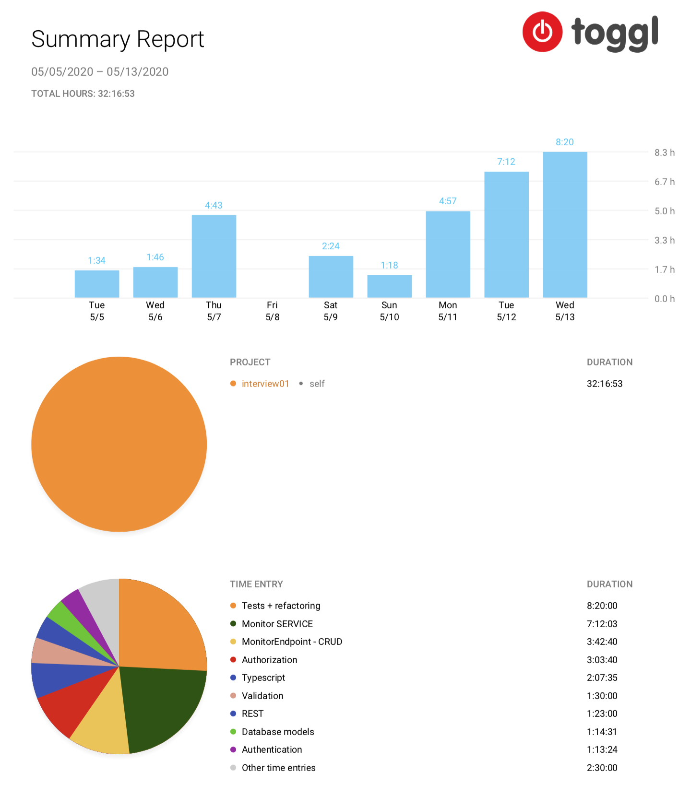

# Node.js Backend Developer Interview

The goal of this interview was to create `Endpoints monitoring service`.

Thank you for well prepared specification. It was fun and good practise.

[Specification PDF here.](res/specification.pdf)

## How to start

1. Install Docker for Desktop from https://www.docker.com/products/docker-desktop
2. Clone the project `git clone https://github.com/webinoo/nodejs-backend-interview.git`
3. In the project folder run `docker-compose up --build`

## How to use

Please read Specification before using it.

1. Install Insomnia Core from
   https://insomnia.rest
2. In Insomnia import [data json file](res/Insomnia_2020-05-13.json) stored in `res` folder
3. Now you can play with requests in Insomnia

## Notes

- Monitor Service Tests coverage: 
- Beside REST I prefer GraphQL :)

## Toggl Time Report

- Gross time: 8 days
- Net time: 32 hours

[Time Report PDF here.](res/toggl.pdf)

## Known Issues / TODO's

- DB naming from camelCase/PascalCase to under_score (have to tune and troubleshoot the models) - for initial development it was easier to match models, if somebody can't handle it - I'm sorry :-)
- ESLint & Prettier
- Replace Bookshelf & Knex require's by imports (have to resolve the Typescript types related to it)
- Few occurences without type (`any`) replace by specific type
- More tests: resolvers (supertest) and db controller (have to manage mocking the model chained functions)

## Author

[My Linkedin](https://www.linkedin.com/in/webino/)
